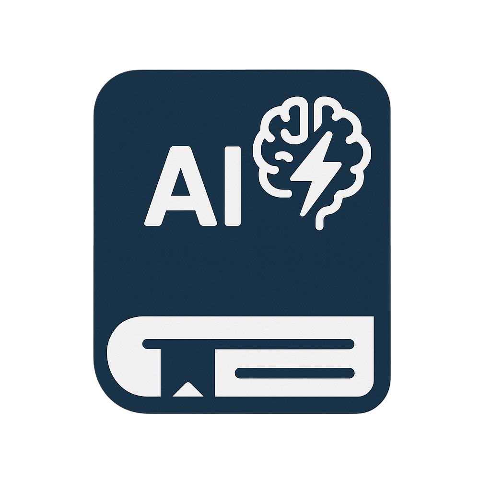

  

# AI-Powered Dictionary Extension

## What is this extension?

This browser extension is an advanced dictionary tool powered by Artificial Intelligence. It goes beyond simple word definitions, providing a richer and more contextual understanding of words and phrases.

## Why is it superior to a conventional dictionary?

Traditional dictionaries offer static definitions. This AI-powered dictionary offers several advantages:

*   **Contextual Understanding:** Leverages AI to understand the context in which a word is used, providing more relevant and nuanced definitions.
*   **Dynamic & Learning:** The AI can continuously learn and update its knowledge, offering up-to-date information and usage examples.
*   **Beyond Definitions:** Potentially offers features like synonym suggestions based on context, example sentences generated by AI, and even explanations of complex concepts or idioms. (We can refine this as we know more about specific features).
*   **Enhanced User Experience:** Aims to provide a more intuitive and helpful experience than simply looking up a word in a static list.

## Installation

*   You must have access to an API endpoint and an API key for the AI service (e.g., Gemini).
*   Download or clone this repository to your computer.
*   Open the extension files and add your API key in the appropriate place (see `src/background.mjs`).
*   In your browser, go to the Extensions page (`chrome://extensions/` in Chrome), enable "Developer mode", and click "Load unpacked".
*   Select the folder containing the extension files to add it to your browser.

## Usage

  <video src="usage.mov" controls width="480">
    Your browser does not support the video tag.
  </video>

